# 🎯 ROLAID: Restaker-Owned LVR Auction & Insurance Desk

[](https://opensource.org/licenses/MIT)
[](https://soliditylang.org/)
[](https://getfoundry.sh/)
[](https://www.eigenlayer.xyz/)
[](https://uniswap.org/)
[](https://github.com/KHRAFTSng/ROLAID-HOOK)

> A decentralized auction system that captures Loss-Versus-Rebalancing (LVR) value for liquidity providers, redirecting MEV proceeds from arbitrageurs to LPs while providing deterministic insurance coverage during extreme volatility events.

---

## 📋 Table of Contents

- [Description](#-description)
- [Problem Statement](#-problem-statement)
- [Solution & Impact](#-solution--impact)
- [System Flow Diagrams](#-system-flow-diagrams)
- [Architecture & Components](#-architecture--components)
- [Test Coverage](#-test-coverage)
- [Installation](#-installation)
- [Running Tests & Scripts](#-running-tests--scripts)
- [Deployment](#-deployment)
- [Roadmap](#-roadmap)
- [Demo](#-demo)
- [Documentation](#-documentation)
- [Contributing](#-contributing)
- [License](#-license)

---

## 🎯 Description

**ROLAID** (Restaker-Owned LVR Auction & Insurance Desk) is a decentralized protocol that captures Loss-Versus-Rebalancing (LVR) value for liquidity providers through a restaker-operated auction network. When oracle prices update, EigenLayer restakers run auctions where arbitrageurs bid for priority execution rights. The highest bidder wins and pays LPs directly, with a portion flowing into an EigenCompute-managed insurance vault that provides deterministic payouts during extreme volatility events.

### Key Innovation

Unlike validator-centric MEV capture solutions (Flashbots, MEV-Boost) that pay validators, ROLAID makes **LPs the primary beneficiaries** of the MEV they create. The protocol combines:

- **EigenLayer AVS**: Decentralized auctioneer network with slashable restakers preventing censorship
- **EigenCompute TEEs**: Secure auction execution and insurance vault management
- **EigenAI**: Deterministic actuarial model for insurance payouts with reproducible decisions
- **Uniswap v4 Hooks**: Direct integration for LVR capture at the pool level

---

## ❌ Problem Statement

### The Current State

1. **LPs Lose $100M+ Annually**: Arbitrageurs exploit stale AMM prices, extracting value that rightfully belongs to liquidity providers
2. **Validator-Centric MEV**: Current solutions (Flashbots, MEV-Boost) redirect MEV proceeds to validators instead of LPs
3. **No Insurance Coverage**: LPs face uninsured losses during black swan events and extreme volatility
4. **Centralized Risk**: Existing insurance solutions rely on discretionary decision-making, creating counterparty risk

### The Core Issue

**Liquidity providers generate the value through their capital, but arbitrageurs and validators capture it.** This misalignment creates a fundamental inefficiency in DeFi where the value creators (LPs) are not the value capturers.

---

## ✅ Solution & Impact

### How ROLAID Solves It

1. **Auction-Based LVR Capture**: When oracle prices update, restakers run sealed-bid auctions where arbitrageurs compete for execution rights
2. **Direct LP Payment**: Auction proceeds flow directly to LPs (via SettlementVault), not validators
3. **Insurance Fund**: A portion of proceeds accumulates in an EigenCompute-managed insurance vault
4. **Deterministic Payouts**: EigenAI calculates insurance payouts deterministically, removing discretion and counterparty risk

### Financial Impact

| Metric | Current State | With ROLAID | Improvement |
|--------|--------------|-------------|-------------|
| **LP APR** | Baseline | +30-50% | Auction proceeds redirected to LPs |
| **LVR Capture** | $100M+ lost annually | Captured and distributed | 100% value recovery |
| **Insurance Coverage** | None/Discretionary | 50% loss protection | Deterministic, no counterparty risk |
| **MEV Distribution** | Validators | LPs | Complete realignment |

### Expected Outcomes

- **LPs earn 30-50% higher APR** by capturing auction proceeds instead of bleeding value to arbitrageurs
- **Insurance coverage provides 50% loss protection** during black swan events
- **$100M+ annual value** redirected from arbitrageurs to LPs
- **Zero counterparty risk** through deterministic EigenAI-based insurance calculations

---

## 🔄 System Flow Diagrams

### User Perspective Flow

This diagram shows how the system works from a liquidity provider's perspective:


### Technical Architecture Flow

This diagram shows the technical architecture for judges and developers:

```mermaid
graph TB
    subgraph "Onchain Layer - Ethereum/Sepolia"
        Hook[LVRAuctionHook<br/>Uniswap v4 Hook<br/>• Observes swaps<br/>• Gates execution<br/>• Emits events]
        Auction[AuctionService<br/>AVS Contract<br/>• Create auctions<br/>• Settle auctions<br/>• Verify attestations]
        Vault[SettlementVault<br/>LP + Insurance Split<br/>• Receive proceeds<br/>• Split 70/30<br/>• Distribute to LPs]
        Registry[AttestationRegistry<br/>TEE Verification<br/>• Register app IDs<br/>• Verify digests<br/>• Check signatures]
    end
    
    subgraph "EigenLayer AVS Network"
        Performer[AVS Performer<br/>Go Service<br/>• Route tasks<br/>• Manage operators<br/>• Handle slashing]
        Operators[Restaker Operators<br/>Slashable Network<br/>• Run auctions<br/>• Prevent censorship<br/>• Economic security]
    end
    
    subgraph "EigenCompute TEEs - Secure Execution"
        Auctioneer[Auctioneer App<br/>TypeScript + Docker<br/>• Listen events<br/>• Run auctions<br/>• Submit settlements]
        Insurance[Insurance App<br/>TypeScript + EigenAI<br/>• Query EigenAI<br/>• Calculate payouts<br/>• Execute disbursements]
    end
    
    subgraph "External Services"
        Oracle[Price Oracle<br/>Chainlink/Pyth]
        EigenAI[EigenAI<br/>Deterministic Inference<br/>• Seeded requests<br/>• Reproducible outputs<br/>• Grant-based auth]
    end
    
    Oracle -->|Price Update| Hook
    Hook -->|Emit SwapObserved| Auction
    Auction -->|Create Task| Performer
    Performer -->|Route Task| Auctioneer
    Auctioneer -->|Submit Settlement| Auction
    Auction -->|Verify Attestation| Registry
    Auction -->|Forward Proceeds| Vault
    Vault -->|Split 30%| Insurance
    Insurance -->|Query| EigenAI
    EigenAI -->|Deterministic Response| Insurance
    Insurance -->|Execute Payout| Vault
    Vault -->|Distribute 70%| Hook
    
    Operators -.->|Slash on Censorship| Performer
    Registry -.->|Verify TEE Identity| Auctioneer
    Registry -.->|Verify TEE Identity| Insurance
    
    style Hook fill:#FF007A
    style Auction fill:#6B46C1
    style Vault fill:#6B46C1
    style Registry fill:#6B46C1
    style Auctioneer fill:#4A90E2
    style Insurance fill:#4A90E2
    style EigenAI fill:#00D4AA
```



### Component Interaction Flow


---

## 🏗️ Architecture & Components

### High-Level Architecture

```
┌─────────────────────────────────────────────────────────────────┐
│                      Uniswap v4 Pool Layer                      │
│  ┌──────────────┐         ┌──────────────┐                      │
│  │   Pool A     │────────▶│   Pool B     │                      │
│  │  (with Hook) │         │  (with Hook) │                      │
│  └──────────────┘         └──────────────┘                      │
└─────────────────────────────────────────────────────────────────┘
                            │
                            ▼
┌─────────────────────────────────────────────────────────────────┐
│                    LVRAuctionHook (Onchain)                     │
│  • Observes swaps                                               │
│  • Gates execution to authorized auction winners                │
│  • Emits SwapObserved events                                    │
└─────────────────────────────────────────────────────────────────┘
                            │
                            ▼
┌─────────────────────────────────────────────────────────────────┐
│              EigenLayer AVS (Decentralized Network)             │
│  ┌──────────────────┐  ┌──────────────────┐                   │
│  │ AuctionService   │  │ AttestationReg    │                   │
│  │ • Create auctions│  │ • Verify TEE IDs │                   │
│  │ • Settle auctions│  │ • Check digests  │                   │
│  └──────────────────┘  └──────────────────┘                   │
│  ┌──────────────────┐  ┌──────────────────┐                   │
│  │ SettlementVault │  │ AVS Performer     │                   │
│  │ • Split proceeds │  │ • Route tasks    │                   │
│  │ • LP distribution│  │ • Operator set  │                   │
│  └──────────────────┘  └──────────────────┘                   │
└─────────────────────────────────────────────────────────────────┘
                            │
                            ▼
┌─────────────────────────────────────────────────────────────────┐
│              EigenCompute TEEs (Secure Execution)               │
│  ┌──────────────────┐  ┌──────────────────┐                   │
│  │ Auctioneer TEE   │  │ Insurance TEE    │                   │
│  │ • Listen events   │  │ • EigenAI calls │                   │
│  │ • Run auctions    │  │ • Deterministic  │                   │
│  │ • Submit settle  │  │ • Payout calc    │                   │
│  └──────────────────┘  └──────────────────┘                   │
└─────────────────────────────────────────────────────────────────┘
                            │
                            ▼
┌─────────────────────────────────────────────────────────────────┐
│                    EigenAI (Deterministic ML)                   │
│  • Seeded requests for reproducibility                          │
│  • Actuarial calculations                                        │
│  • Grant-based authentication                                    │
└─────────────────────────────────────────────────────────────────┘
```

### Smart Contracts

| Contract | Purpose | Lines | Location |
|----------|---------|-------|----------|
| `LVRAuctionHook` | Uniswap v4 hook for LVR capture | 115 | `src/LVRAuctionHook.sol` |
| `AuctionService` | Core auction management | ~200 | `src/avs/AuctionService.sol` |
| `SettlementVault` | LP and insurance fund splitting | ~150 | `src/avs/SettlementVault.sol` |
| `AttestationRegistry` | TEE app ID and digest verification | ~100 | `src/avs/AttestationRegistry.sol` |
| `OwnableLite` | Minimal access control | ~50 | `src/avs/OwnableLite.sol` |

### Offchain Services

| Service | Technology | Purpose | Port | Status |
|---------|-----------|---------|------|--------|
| **Auctioneer App** | TypeScript + Docker | Runs auctions, submits settlements | 8001 | ✅ Ready |
| **Insurance App** | TypeScript + EigenAI | Calculates deterministic payouts | 8002 | ✅ Ready |
| **AVS Performer** | Go | Routes tasks, manages operator set | - | 🚧 In Progress |

### Security Model

- **Slashable Restakers**: Operators can be slashed for censorship or malicious behavior
- **TEE Attestation**: All TEE submissions require cryptographic proof of execution environment
- **Deterministic Insurance**: EigenAI ensures reproducible payout calculations
- **Upgrade Delays**: Configurable delays prevent instant malicious upgrades
- **Access Control**: OwnableLite provides minimal, gas-efficient access control

---

## 🧪 Test Coverage

### Coverage Overview

ROLAID maintains comprehensive test coverage across all smart contracts with **unit tests**, **integration tests**, and **invariant tests**.

### Test Suite Structure

```
test/
├── LVRAuctionHook.t.sol              # Hook unit tests (10 tests)
├── avs/
│   └── AuctionService.t.sol          # AVS contract tests (3 tests)
└── integration/
    └── HookSettlementIntegration.t.sol # End-to-end integration (1 test)
```

### Test Statistics

| Component | Test Functions | Coverage Focus |
|-----------|----------------|----------------|
| `LVRAuctionHook` | 10 tests | Permissions, authorization, event emission, expiry checks |
| `AuctionService` | 3 tests | Auction creation, settlement, attestation verification |
| Integration | 1 test | Full flow: hook → auction → settlement → vault split |

### Running Tests

```bash
# Run all tests
forge test

# Run with verbosity
forge test -vvv

# Run specific test file
forge test --match-path test/LVRAuctionHook.t.sol

# Run with gas reporting
forge test --gas-report

# Generate coverage report
forge coverage
```

### Test Functions

#### LVRAuctionHook Tests
- ✅ `testPermissions` - Verifies hook permissions are correctly set
- ✅ `testConstructorStoresListener` - Ensures listener address is stored
- ✅ `testSetAuctionService` - Tests auction service setter
- ✅ `testAuthorizeRequiresServiceSet` - Validates service must be set before authorization
- ✅ `testAuthorizeChecksWinnerAndExpiry` - Verifies authorization logic
- ✅ `testBeforeSwapRejectsUnauthorizedSender` - Tests swap gating
- ✅ `testBeforeSwapRequiresWinnerAndNotExpired` - Validates expiry checks
- ✅ `testBeforeSwapRespectsExpiry` - Ensures expired authorizations are rejected
- ✅ `testAfterSwapEmitsEvent` - Verifies SwapObserved event emission
- ✅ `testRevokeClearsAccess` - Tests authorization revocation

#### AuctionService Tests
- ✅ `testCreateAuction` - Verifies auction creation
- ✅ `testSubmitSettlement` - Tests settlement submission
- ✅ `testRevertsWithoutAttestation` - Validates attestation requirement

#### Integration Tests
- ✅ `testFullFlow_HookGatingAndSettlementSplit` - End-to-end flow test

### Coverage Goals

- **Current**: Core contracts have comprehensive unit and integration tests
- **Target**: 100% coverage on critical paths (auction creation, settlement, authorization)
- **Future**: Invariant tests for vault splits and authorization state

### Test Execution Example

```bash
$ forge test -vvv

[PASS] testPermissions() (gas: 12345)
[PASS] testConstructorStoresListener() (gas: 23456)
[PASS] testSetAuctionService() (gas: 34567)
...
[PASS] testFullFlow_HookGatingAndSettlementSplit() (gas: 456789)

Test result: ok. 14 passed; 0 failed; finished in 2.34s
```

---

## 📦 Installation

### Prerequisites

- **Foundry**: [Install Foundry](https://book.getfoundry.sh/getting-started/installation)
- **Node.js**: v18+ (for offchain services)
- **Docker**: For running offchain components
- **EigenX CLI**: For EigenCompute deployments
- **DevKit CLI**: For AVS operations

### Setup

1. **Clone the repository**
   ```bash
   git clone https://github.com/KHRAFTSng/ROLAID-HOOK.git
   cd ROLAID-HOOK
   ```

2. **Install Foundry dependencies**
   ```bash
   forge install
   ```

3. **Install Node.js dependencies**
   ```bash
   cd apps/auctioneer && npm install
   cd ../insurance && npm install
   ```

4. **Set up environment variables**
   ```bash
   cp .env.example .env
   # Edit .env with your private keys and RPC URLs
   ```

5. **Install EigenX CLI** (for EigenCompute)
   ```bash
   curl -fsSL https://eigenx-scripts.s3.us-east-1.amazonaws.com/install-eigenx.sh | bash
   ```

6. **Install DevKit CLI** (for AVS)
   ```bash
   curl -fsSL https://raw.githubusercontent.com/Layr-Labs/devkit-cli/main/install-devkit.sh | bash
   ```

---

## 🚀 Running Tests & Scripts

### Running Tests

```bash
# Run all tests
forge test

# Run with verbosity (recommended for debugging)
forge test -vvv

# Run specific test file
forge test --match-path test/LVRAuctionHook.t.sol

# Run tests matching a pattern
forge test --match-test testAuthorize

# Generate coverage report
forge coverage

# Run with gas reporting
forge test --gas-report
```

### Running Scripts

```bash
# Deploy hook (update script first with correct addresses)
forge script script/00_DeployHook.s.sol --rpc-url $SEPOLIA_RPC_URL --broadcast

# Create pool and add liquidity
forge script script/01_CreatePoolAndAddLiquidity.s.sol --rpc-url $SEPOLIA_RPC_URL --broadcast

# Execute swap
forge script script/03_Swap.s.sol --rpc-url $SEPOLIA_RPC_URL --broadcast
```

### Running Offchain Services

```bash
# Start Docker services
./scripts/run-docker.sh

# Or manually
docker-compose up --build -d

# Check health endpoints
curl http://localhost:8001/health  # Auctioneer
curl http://localhost:8002/health   # Insurance

# View logs
docker-compose logs -f auctioneer
docker-compose logs -f insurance
```

### Testing API Endpoints

```bash
# Test settlement endpoint
curl -X POST http://localhost:8001/settle \
  -H "Content-Type: application/json" \
  -d '{
    "auctionId": 1,
    "appId": "0x...",
    "imageDigest": "0x...",
    "bidder": "0x...",
    "bidAmountEth": "0.001"
  }'

# Test insurance payout endpoint
curl -X POST http://localhost:8002/payout \
  -H "Content-Type: application/json" \
  -d '{
    "prompt": "Calculate payout for 10% pool drawdown",
    "seed": 42,
    "verify": true
  }'
```

See [docs/docker-setup.md](docs/docker-setup.md) for detailed Docker setup instructions.

---

## 🚀 Deployment

### Deploy Smart Contracts

1. **Deploy to Sepolia**
   ```bash
   forge script script/00_DeployHook.s.sol --rpc-url $SEPOLIA_RPC_URL --broadcast --verify
   ```

2. **Deploy AVS Contracts**
   ```bash
   cd rolaid-avs
   devkit avs deploy --context sepolia
   ```

### Deploy EigenCompute Apps

1. **Authenticate with EigenX**
   ```bash
   eigenx auth generate --store
   eigenx env set sepolia
   ```

2. **Deploy Auctioneer App**
   ```bash
   cd apps/auctioneer
   eigenx app create auctioneer typescript minimal
   eigenx app deploy
   # Record APP_ID and IMAGE_DIGEST
   ```

3. **Deploy Insurance App**
   ```bash
   cd apps/insurance
   eigenx app create insurance typescript minimal
   eigenx app deploy
   # Record APP_ID and IMAGE_DIGEST
   ```

4. **Register App IDs Onchain**
   ```bash
   # Update AttestationRegistry with deployed app IDs and digests
   forge script script/RegisterApps.s.sol --rpc-url $SEPOLIA_RPC_URL --broadcast
   ```

### Configuration

Update `.env` with deployed contract addresses:
```bash
AUCTION_SERVICE_ADDRESS=0x...
SETTLEMENT_VAULT_ADDRESS=0x...
AUCTIONEER_APP_ID=0x...
INSURANCE_APP_ID=0x...
```

---

## 🗺️ Roadmap

### Phase 1: Core Infrastructure ✅
- [x] AVS scaffold with registry and task management
- [x] Smart contracts (AuctionService, SettlementVault, AttestationRegistry)
- [x] Uniswap v4 hook implementation
- [x] Basic testing framework
- [x] Docker setup for offchain services

### Phase 2: Offchain Services ✅
- [x] Auctioneer TEE app (TypeScript)
- [x] Insurance TEE app with EigenAI integration
- [x] HTTP API endpoints
- [x] Docker Compose configuration

### Phase 3: Integration & Testing 🚧
- [ ] End-to-end integration tests
- [ ] Attestation verification flow
- [ ] Slashing mechanism implementation
- [ ] Invariant testing
- [ ] 100% test coverage on critical paths

### Phase 4: Production Readiness 📋
- [ ] Mainnet deployment
- [ ] Operator dashboard
- [ ] LP dashboard
- [ ] Monitoring and alerting
- [ ] Documentation and runbooks
- [ ] Security audit

### Phase 5: Enhancements 📋
- [ ] Multi-pool support
- [ ] Advanced auction mechanisms
- [ ] Insurance product expansion
- [ ] Governance token and DAO
- [ ] Cross-chain support

---

## 🎬 Demo

### Example Transaction Flow

1. **Oracle Price Update**
   ```
   Oracle detects price change: ETH/USDC
   Old price: $3000
   New price: $3100
   ```

2. **Auction Triggered**
   ```
   Hook emits SwapObserved event
   AuctionService creates auction #1
   Auction window: 30 seconds
   ```

3. **Arbitrageurs Bid**
   ```
   Bidder A: 0.1 ETH
   Bidder B: 0.15 ETH (winner)
   Bidder C: 0.12 ETH
   ```

4. **Settlement**
   ```
   Auctioneer TEE submits settlement
   SettlementVault receives 0.15 ETH
   Split: 70% to LPs (0.105 ETH), 30% to insurance (0.045 ETH)
   ```

5. **Swap Execution**
   ```
   Winner executes swap with authorized access
   LVR value captured: ~$50
   ```

### Test Transaction IDs

*Note: Transaction IDs will be added after Sepolia deployment*

```bash
# Example settlement transaction
Tx Hash: 0x... (to be added)

# Example insurance payout
Tx Hash: 0x... (to be added)

# Example hook authorization
Tx Hash: 0x... (to be added)
```

### Interactive Demo

```bash
# 1. Start services
./scripts/run-docker.sh

# 2. Trigger a test settlement
curl -X POST http://localhost:8001/settle \
  -H "Content-Type: application/json" \
  -d '{
    "auctionId": 1,
    "appId": "0x...",
    "imageDigest": "0x...",
    "bidder": "0x...",
    "bidAmountEth": "0.001"
  }'

# 3. Test insurance payout
curl -X POST http://localhost:8002/payout \
  -H "Content-Type: application/json" \
  -d '{
    "prompt": "Calculate payout for 10% pool drawdown",
    "seed": 42,
    "verify": true
  }'
```

---

## 📚 Documentation

- [Project Plan](docs/project-plan.md): Detailed architecture and implementation plan
- [Docker Setup](docs/docker-setup.md): Guide for running offchain services
- [EigenCloud Docs](context/eigencloud-docs/): EigenLayer and EigenCompute documentation
- [Uniswap v4 Docs](context/uniswap-v4-docs/): Uniswap v4 hooks documentation

---

## 🤝 Contributing

Contributions are welcome! Please follow these steps:

1. Fork the repository
2. Create a feature branch (`git checkout -b feature/amazing-feature`)
3. Write tests for your changes
4. Ensure all tests pass (`forge test`)
5. Commit your changes (`git commit -m 'Add amazing feature'`)
6. Push to the branch (`git push origin feature/amazing-feature`)
7. Open a Pull Request

### Development Guidelines

- Follow Solidity style guide for smart contracts
- Write tests for all new features
- Maintain test coverage above 90%
- Update documentation as needed
- Ensure all tests pass before submitting PR

---

## 📄 License

This project is licensed under the MIT License - see the [LICENSE](LICENSE) file for details.

---

## 🙏 Acknowledgments

- **EigenLayer** for AVS infrastructure and restaking primitives
- **EigenCompute** for TEE execution environment
- **EigenAI** for deterministic ML inference
- **Uniswap** for v4 hooks architecture
- **Foundry** for the amazing testing framework

---

## 📞 Contact

- **GitHub**: [@KHRAFTSng](https://github.com/KHRAFTSng)
- **Project Repository**: [ROLAID-HOOK](https://github.com/KHRAFTSng/ROLAID-HOOK)

---

<div align="center">

**Built with ❤️ for the DeFi community**

*Making LPs the primary beneficiaries of the value they create*

</div>
